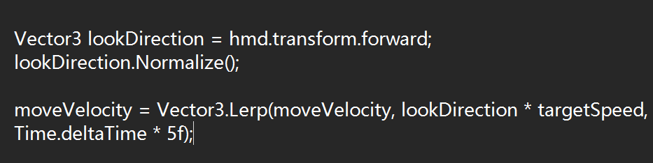
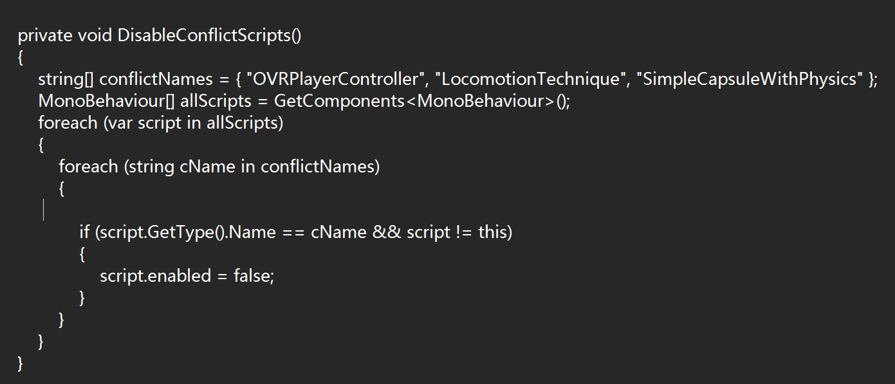
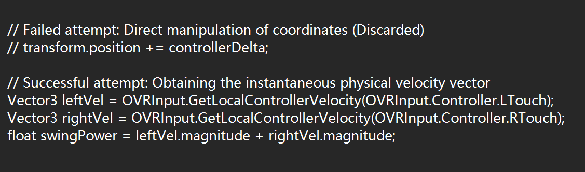
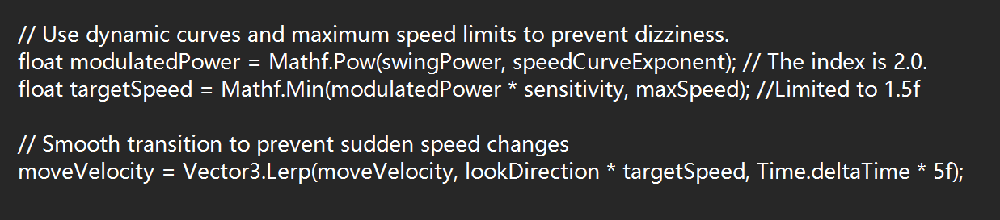

**Hybrid Biometric Locomotion: Ground-Walk＋Sky-Flight**

In this experiment, I designed a system called "Hybrid Dynamics" to provide an immersive and comfortable VR experience using natural body movements.

* **Walk Mode**: "Walking"
  Players use the Index Trigger and alternate swinging their arms up and down to move. The system mimics human walking, from slow walking to running.

* **Flight Mode**: "Avian Flight"
  To address vertical challenges (like high coins), I added a "bird flight" metaphor. Players can spread their arms and look up to seamlessly transition from walking to flying.

**Goal**: To use body movement and visual feedback to improve immersion and reduce motion sickness.

#### **2. Technical Implementation**

The core logic of my code converts physical movements into 3D space vectors.

* **A. Core Logic: Gaze-directed Steering**
  I didn't write complex mode-switching code. Instead, I used a mathematical approach that tracks the HMD’s forward vector.

  * **Explanation**:

    * When players look straight ahead, the movement is walking.
    * When they look up and swing their arms, they fly towards their target.

* **B. Parameter Tuning**
  To balance feel and comfort, I set fine-tuned dynamic parameters:

  * `speedCurveExponent = 2.0f`: A quadratic curve, filtering out minor controller shakes, making only intentional swings noticeable.
  * `damping = 5.0f`: Simulates inertia to prevent sudden stop effects, avoiding visual tearing.

#### **3. Process & Problems**

**Challenges**:

1. **Script Conflicts**:
   Unity projects come with default movement scripts that interfered with my custom Arm-Swing logic.
   **Solution**: I created an automatic tool to disable conflicting components during startup.

2. **From "Coordinate Displacement" to "Speed Mapping"**:
   Initially, I tried using positional changes to move the player but it felt unnatural.
   **Solution**: I switched to using the velocity of the controller, making movement feel smoother and more realistic.

3. **Motion Sickness from High-Speed Movement**:
   High-speed arm swings caused a "teleporting" visual effect, leading to motion sickness.
   **Solution**: I introduced a speed curve and a speed cap to smooth the transition between low and high speeds.

#### **4. Lessons Learned**

1. **Comfort First**:
   It’s better to limit maximum speed than to allow players to experience uncomfortable acceleration.

2. **Automation is Key**:
   Automated scripts like FixBannerPhysics save a lot of debugging time.

3. **Focus on Gaze Direction**:
   When designing flight modes, using "head orientation" for movement is more natural and reduces directional errors caused by hand movements.

#### **5. Bonus: Paris-Saclay Flavor**

As a student at Université Paris-Saclay, I incorporated the school’s color (purple) into the project:

* The **Final Banner** was changed to purple.

* The last three coins were given a glowing purple material effect.

#### **6. Code & GitHub**

GitHub repository link: 

https://github.com/u8739516597-dotcom/FInal-project

#### **7. Demo Video**

Video link: [link]

