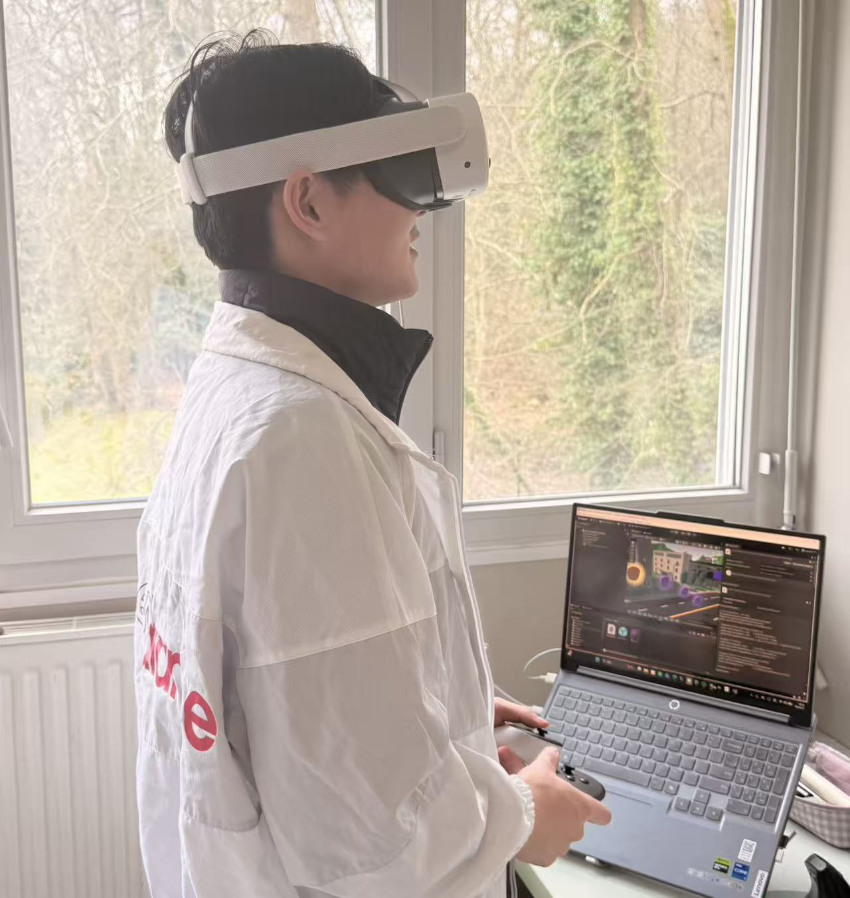

### **Lecture 3: Evaluating Locomotion Technique**

#### 1. **User Study Design**

To test the effectiveness of my "Dynamic Curve Arm Swing Flight" technique, I invited two male volunteers to participate in the test.

* **Participants**: 3 (myself + 2 male classmates).
* **Test task**: Complete the entire Parkour course and collect as many coins as possible.
* **Evaluation metrics**: We recorded the completion time, coin collection accuracy, and conducted a subjective survey (1-10 scale) on motion sickness, workload, presence, and enjoyment.

#### 2. **Raw Data**

Here’s the detailed performance of the three participants:

#### 3. **Dependent Variable Analysis**

We calculated the average results for the three participants:

* **A. Performance**

  * **Average Time per Round**: 134.1 seconds

    * **Analysis**: Participant B was the fastest but missed more coins. Participant A was more careful, taking the longest time.
  * **Average Accuracy**: 94.2%

    * **Calculation**: (68 + 65 + 62) / (69*3) ≈ 94.2%.
  * **Average Completed Rounds**: 1 (all participants successfully finished the course).

* **B. Subjective Measures (1-10 scale)**

#### 4. **Data Discussion and Findings**

* **Motion Sickness Control**: The average score was only 3.0, showing that my "Dynamic Curve" algorithm helps smooth out acceleration, preventing strong nausea, even for participant A who swung their arms more.
* **Learning Curve**: Participant B reported that although swinging arms was tiring (Workload), it felt very real, like “rowing” or “flying,” which significantly increased the sense of presence (7.7) and enjoyment (8.7).
* **Accuracy vs. Speed Trade-off**: Data showed that when participants aimed to finish in under 130 seconds (like participant B), the coin miss rate increased. This suggests that the technique could be optimized for fine-tuning at high speeds.

#### 5. **Implementation Snippet**

Here is the core logic I used in Unity to handle controller speed and apply the dynamic curve:

