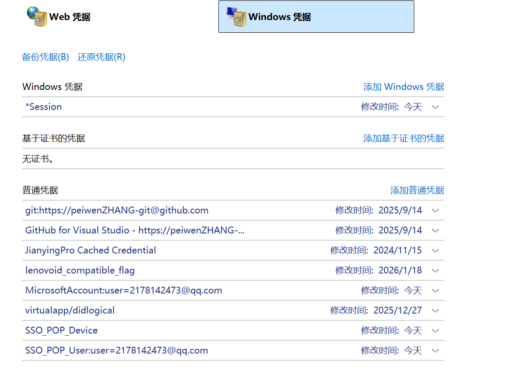
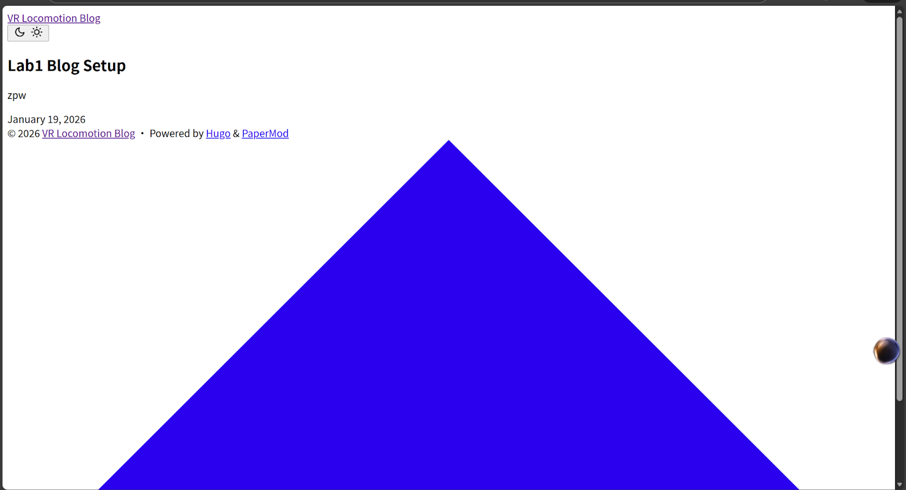
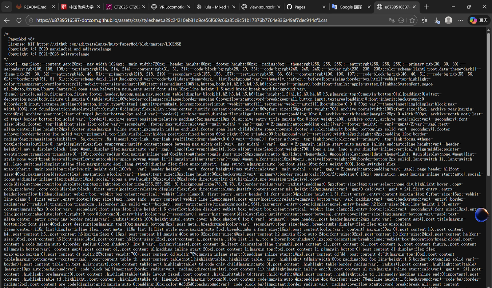

---

title: "Lab 1: VR Locomotion Blog (Hugo + GitHub Pages)"

date: 2026-01-26

tags:
  - Hugo
  - GitHub Pages
  - PaperMod
  - Lab
  - Mixed Reality

---

Authors: Peiwen Zhang, Zeyu Liang.

Université Paris-Saclay, HCI M1.

---

 **1. Final Result**

Our group blog website is successfully online. It can be opened normally and the theme style is displayed correctly.

Website link:  

https://u8739516597-dotcom.github.io/

---

**2. Our Solution**

We use \*\*Hugo\*\* as a static site generator, use \*\*PaperMod\*\* as the theme, and publish the website by \*\*GitHub Pages\*\*.

---

 **3. Project Structure and Publishing Method**

Our repository includes two main parts:

1\) Hugo source files

These files are used to write posts and configure the website, including the `content` folder, the `themes` folder, and the Hugo configuration file.

2\) Generated static website files (docs) 

The generated static website is placed in the `docs` folder. GitHub Pages publishes the website from the `docs` folder in the `main` branch.

Our publishing workflow is:  

After we update content or configuration locally, we generate the website into `docs`, then commit and push to GitHub. After that, the online website is updated.

---

 **4. Problems and Solutions**

 4.1 Problem 1: git push error 403 / permission denied

**Problem:**

When pushing to GitHub, we got a 403 or permission denied error, so we could not push successfully.

**Reason:**

On Windows, Git may still use an old GitHub account credential.

**Solution:**

We opened \*\*Windows Credential Manager\*\*, removed the old GitHub credentials, logged in again, and then pushed successfully.

---

 4.2 Problem 2: CSS does not work on GitHub Pages

**Problem:**  

The website could open, but the CSS style was missing. The page looked like plain HTML.

**Reason:**

PaperMod uses fingerprinting and SRI checks for assets. In the GitHub Pages environment, this caused asset loading issues.

**Solution:**

We disabled the fingerprinting-related options in the Hugo configuration file, regenerated the `docs` folder, and pushed again. After that, the theme worked correctly.

---

 **5. Current Status and Next Plan**

Current status:

1\. GitHub Pages website is online and accessible  

2\. Theme style works correctly  

3\. Repository structure follows the `docs` publishing requirement  

Next plan: 

We will continue using this blog to publish future lab work, including Unity experiments, screenshots, and reflections.

