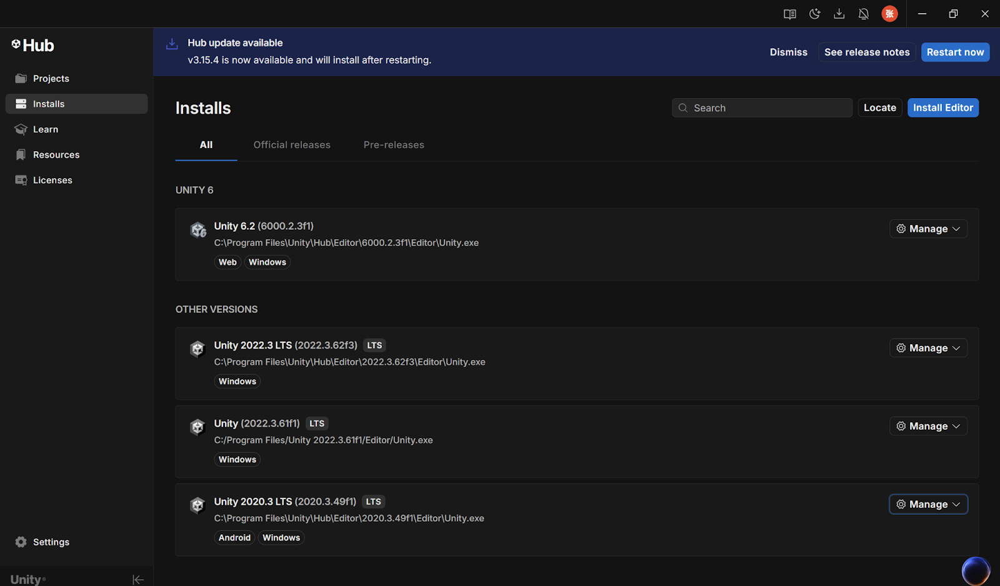
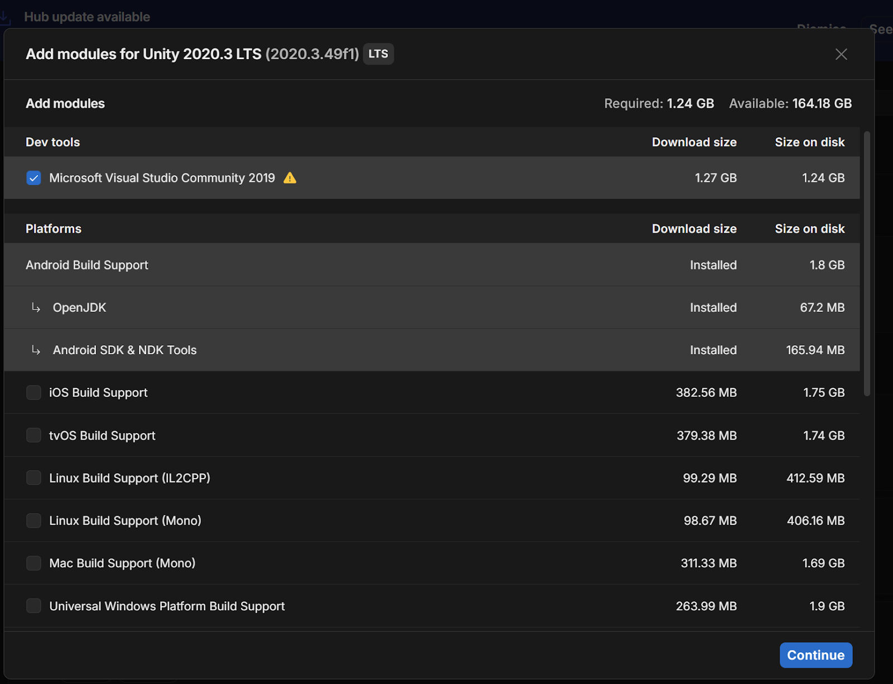
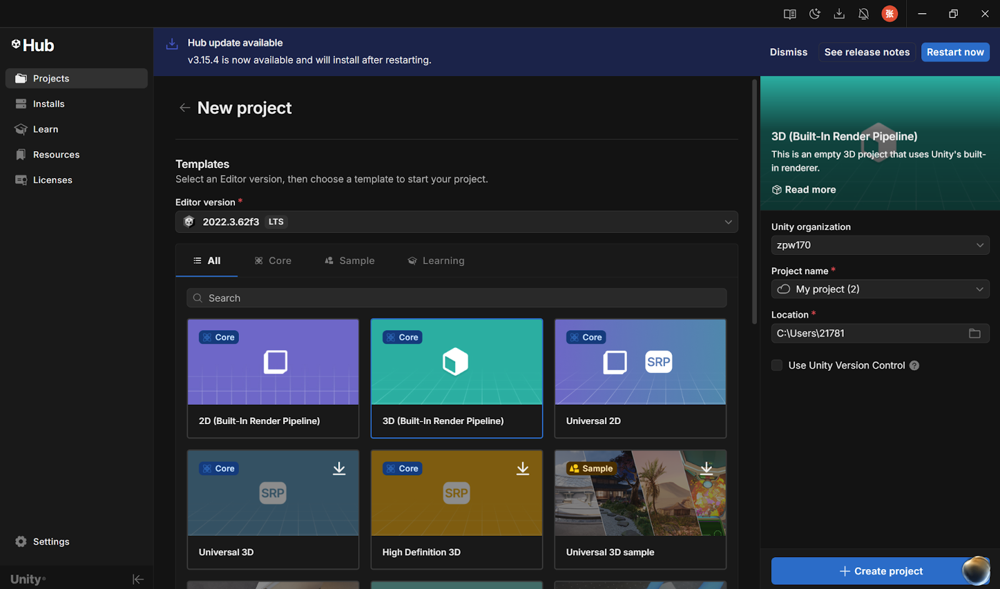

---
title: "Lab 2: Unity Setup Report"
date: 2026-01-20
weight: 3
tags:
  - Unity
  - Lab
  - Mixed Reality
draft: false

---

Unity environment setup on Windows: installed Unity 2020.3.49f1 (LTS), added required modules (IL2CPP, Android Build Support, OpenJDK), and verified by creating a 3D project.

---

**1. Goal**

The goal of this lab is to complete the Unity development environment setup and make sure Unity can run correctly.

---

 **2. Environment Information**

\- Operating System: Windows  

\- Unity Editor Version:\*\* 2020.3.49f1 (Unity 2020 LTS)

---

 **3. Install Unity 2020.3.49f1 and Modules**

3.1 Install Unity via Download Archive

1\. Open the Unity Download Archive website  

2\. Find Unity 2020 LTS and select version \*\*2020.3.49f1\*\*  

3\. Click Install and open Unity Hub to start installation  

---

**3.2 Select Required Modules**

When installing Unity 2020.3.49f1, we selected the following modules:

1\. Windows Build Support (IL2CPP)

2\. Android Build Support

   - Android SDK \& NDK Tools  

3\.OpenJDK

These modules are required for building projects on different platforms.

---

 **4. Create and Run a Unity Project (Verification)**

 4.1 Create a New Project

1\. Open Unity Hub Project New Project  

2\. Select the 3D (or 3D Core) template  

3\. Set the project name and save location  

4\. Click Create

---

 4.2 Unity Editor Overview

After the project is created, we verified that Unity runs correctly:

\- We can open the project successfully  

\- We identified the main panels:

  - Hierarchy  

  - Scene  

  - Game  

  - Inspector  

  - Console  

\- We entered Play Mode and the scene ran normally

---

 **5. Result**

Unity was installed successfully, the required modules were added, and a new Unity project could run without errors.

---

**6. Conclusion**

This lab confirms that the Unity development environment is ready. The setup is correct and can be used for future labs and VR experiments.

