Authors: Peiwen Zhang, Zeyu Liang.

Université Paris-Saclay, HCI M1.

---

Step 1: Setting up the game

 1.1 Create a new project

 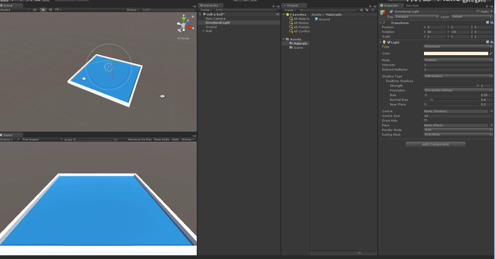 

 1.2 Create a new scene called **Minigame** and save it

   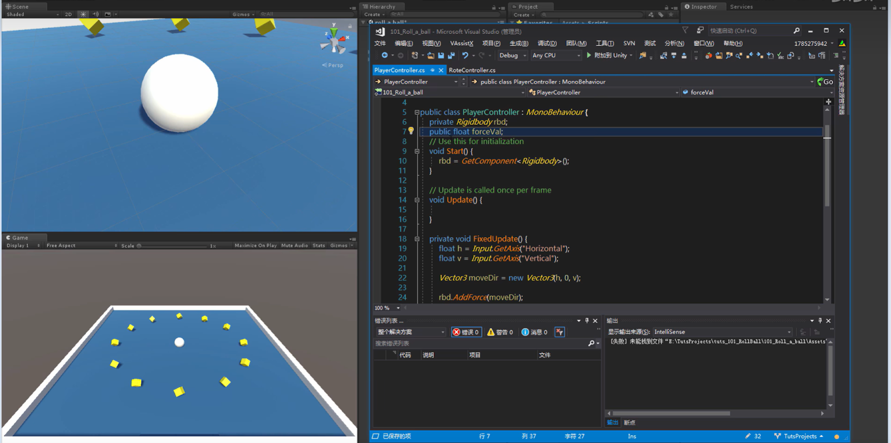 |

1.3 Create a Plane called **Ground** and reset its position

**From this step, I learned to use the F key to focus on the selected object.**

1.4 Change the scale of the Ground object

**Way 1: Use the R key to switch to the Scale tool, then drag the handles to change the scale.**

**Way 2: Change the scale values directly in the Transform component.**

 1.5 Create a Sphere called Player and place it on top of the plane

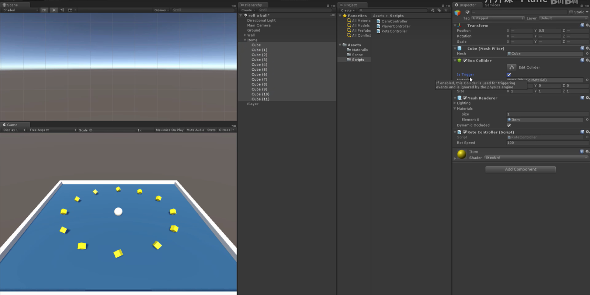

 1.6 Change the color of the light

1.7 Create two materials for objects

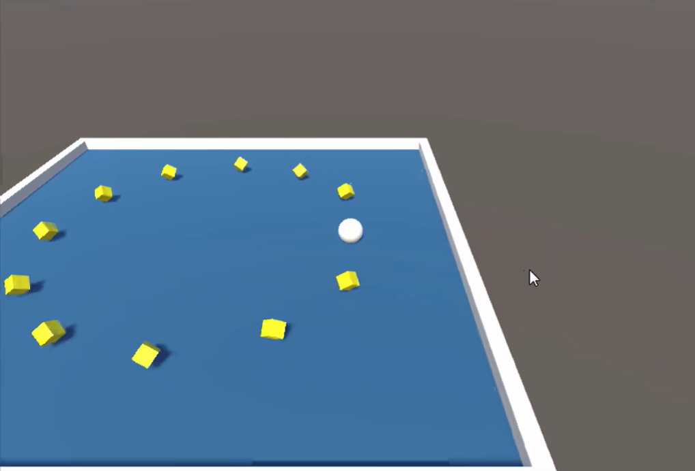

1.8 Adjust the direction of the light

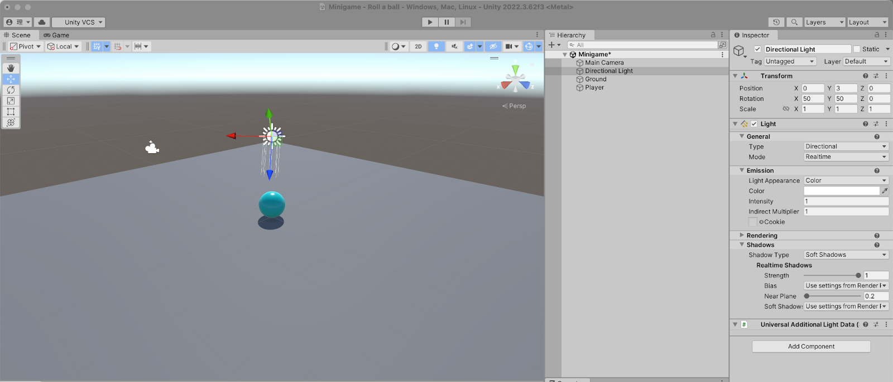

---

Step 2: Moving the player

2.1 Add a physics component on Player

2.2 Add Player Input component on Player

**Problem: I can’t find the Player Input in Unity.**

**Solution: Install the Input System.**

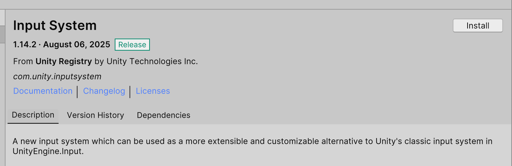  |

2.3 Create and write the script

**Problem: The ball couldn’t move.**
**Solution: I wrote the wrong function.**

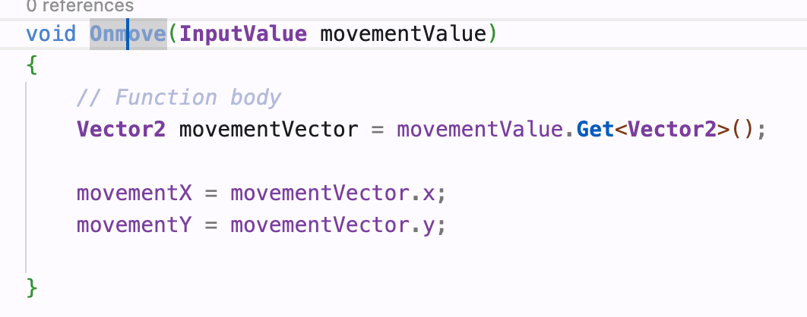

---

 Step 3: Moving the camera

3.1 Set the camera position and make it follow the player’s movement

3.2 Create and write a script for the camera to follow the player

---

Step 4: Setting up the play area

Create walls and give them materials.

---

 Step 5: Creating Collectibles

 5.1 Create a pickup object and give it a material

 5.2 Write a script to rotate the pickup object

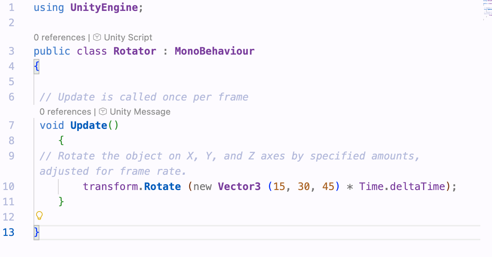

5.3 Turn the pickup into a prefab and duplicate more

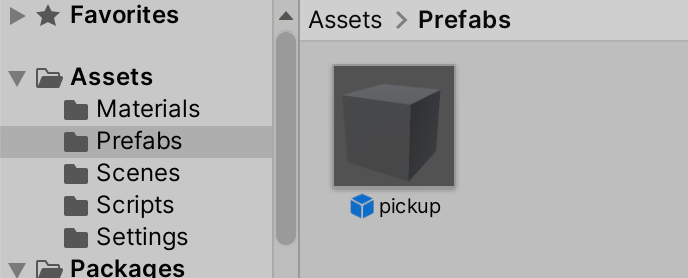

**Question: Are there some tools like an Array Modifier in Blender to make this step easier?**

---

Step 6: Detecting collisions with collectibles

 6.1 Change the PlayerController script (add a new function called `OnTriggerEnter`)

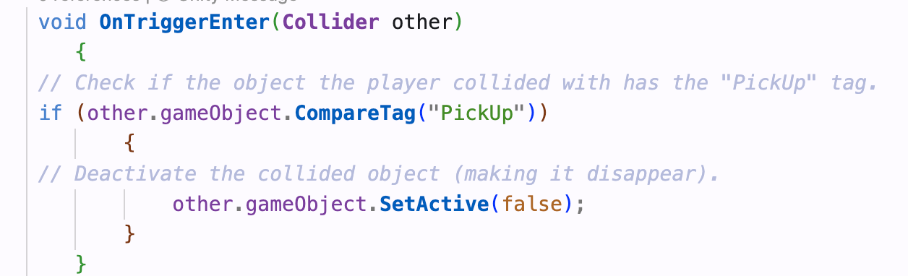

6.2 Add tag for the prefab

6.3 Change the Collider of the prefab

---

Step 7: Displaying score and text

7.1 Change the PlayerController script (create a counter)

7.2 Create a text and change the anchor mode

**Problem: I can’t change the position of the text.**  
**Solution: I used the wrong key (shift + option).**

7.3 Set the win condition

---

 Step 8: Adding AI navigation

8.1 Create enemy body and add NavMeshSurface component for it

**Problem: I can’t find it.**  

**Solution: After installing the package, it worked.**

8.2 Use a script to chase the player

8.3 Complicate the map and add obstacles

8.4 Set the win and lose conditions

---

Bonus: IP Paris flavor

I’m not 100% sure if I fully understood what “IP Paris flavor” is supposed to mean, but I tried to add some Paris-themed elements into my game anyway.

 1) Change the ground texture

 2) Replace the pickups with Paris landmarks

**Problem:I downloaded a `.glb` model from Sketchfab, but Unity couldn’t open it properly (nothing showed up).** 

**Solution: I imported the `.glb` file into Blender, then exported it as `.fbx`, and that worked fine in Unity.**

**Problem: Since I was using prefabs, once I changed the mesh, it applied to all pickups — but I only wanted to modify some of them.** 

**Solution:I created a prefab variant so I could make small changes (like changing the model) while keeping the same logic.**

 3) Rewrite the movement script

The old rotation script didn’t really work with the new models, so I replaced it with a simple floating animation.  

Now the landmarks float up and down slowly, making them feel more alive.

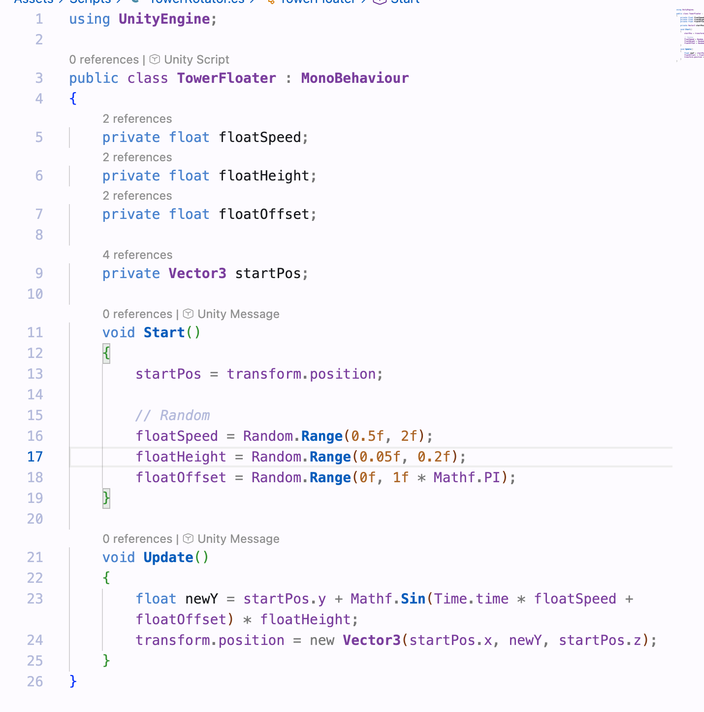

