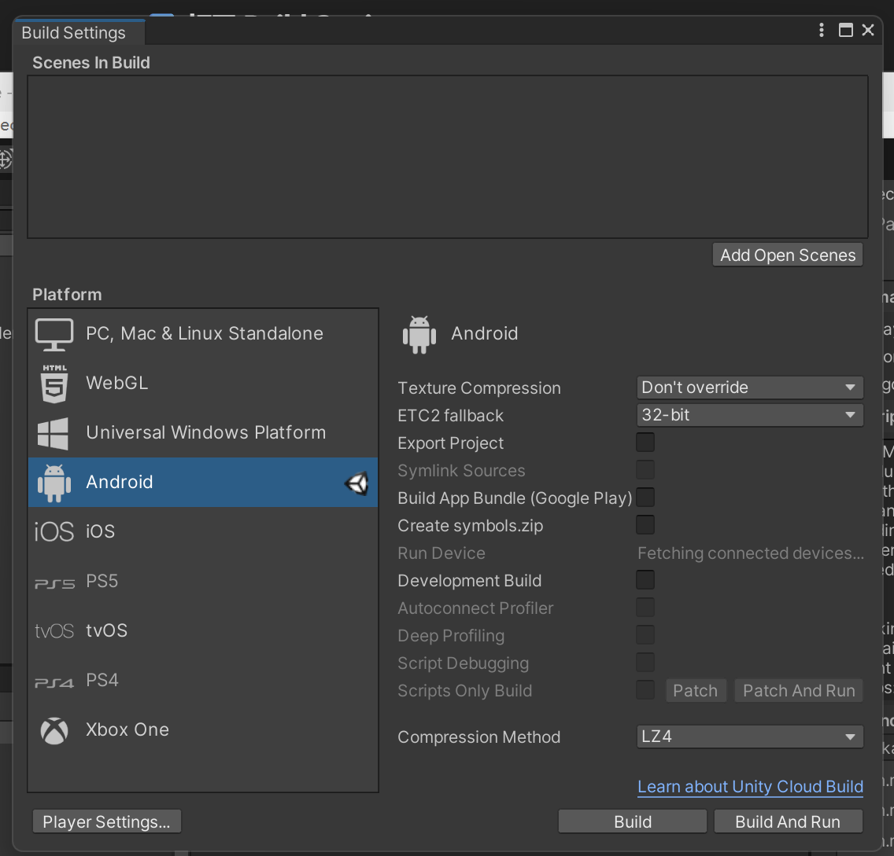
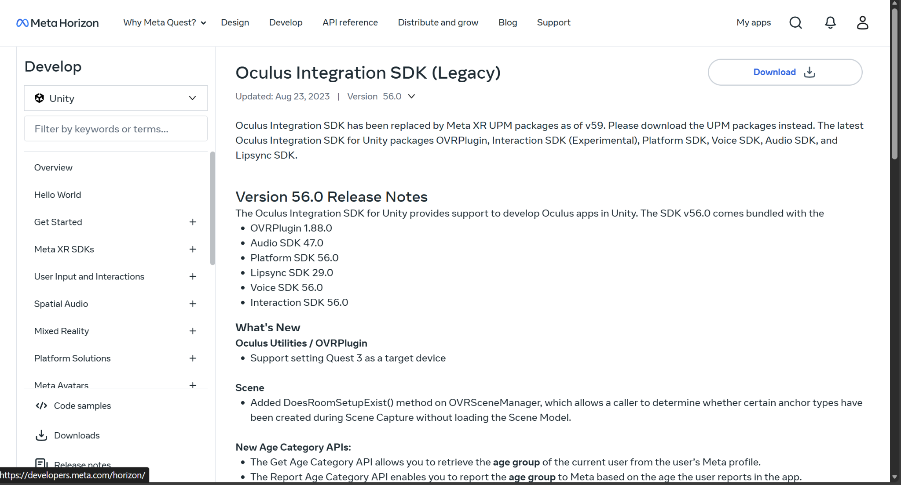
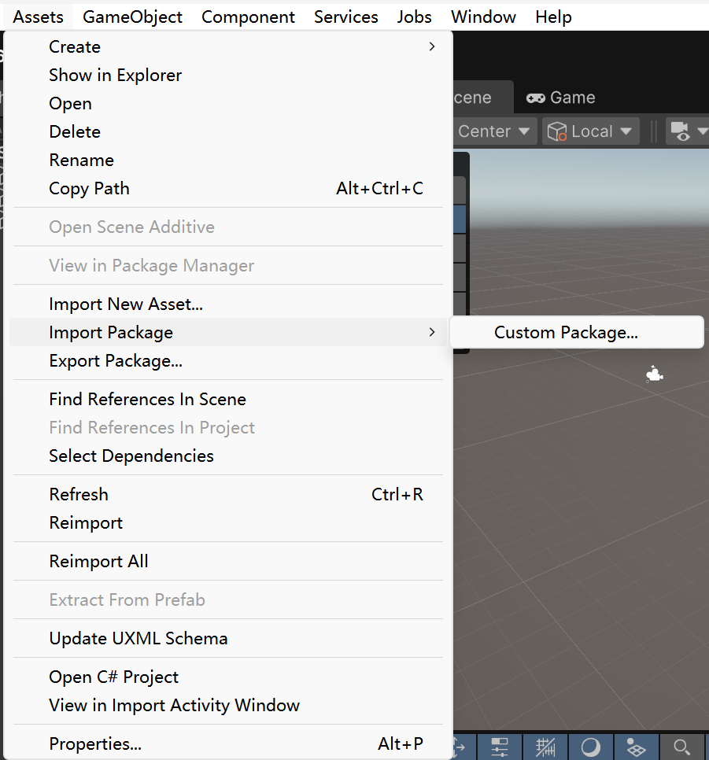
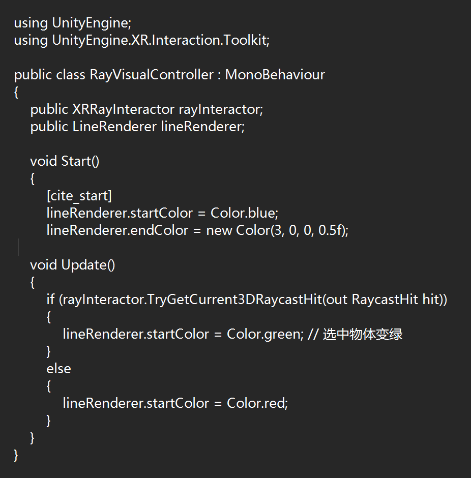

---
title: "Lab 4: Unity Roll-a-Ball in VR"
date: "2026-02-06"
weight: 5
draft: false
---

**Lab 4: Unity Roll-a-Ball in VR**

 **Objective:**

   This blog records my process of making the classic Roll-a-Ball game in Unity and adapting it to the VR environment. The main focus is on switching from keyboard controls to VR controller interactions. It also covers implementing the two main interaction techniques in VR: Direct Selection and Raycasting.

 **Implementation Process**
   

**Part 1**: Turning Unity project into a VR project for Quest

 Switch to Android platform
   Unity: File > Build Settings > Android > Switch Platform

Import Meta XR (Oculus) SDK
   Initially, I searched Asset Store for the Meta XR All-in-One SDK, but it was incompatible, so I downloaded and imported Meta XR SDK v56.

Install XR Plugin Management
   Go to Edit > Project Settings > XR Plug-in Management

**Part 2**: Importing Roll-a-Ball from Lab 2 into the VR scene

1. In the VR project, import the Lab 2 project
   Assets > Import Package > Custom Package

2. **Fix Errors**

   After importing, there was an error because Oculus Integration also had a script called PlayerController.
   I renamed the Roll-a-Ball PlayerController.cs and commented out the Input System code. I then used Oculus/Meta input methods.

3. **Implement Interaction Techniques**

   **Direct Selection**

    * Add the XR Direct Interactor component to the left and right controllers.
    * Add a Sphere Collider to act as the interaction trigger zone, checking "Is Trigger" to avoid physical collisions.

   **Raycasting**

   * Add XR Ray Interactor component to the controller.
   * Add XR Interactor Line Visual and Line Renderer for visual effects.
   * Ensure the Layer for the coins is within the raycast's detection range.

 **Problems and Solutions**

   * **Problem 1**: Coins can't be selected by raycast

     * **Cause**: Coins were missing the XR Grab Interactable component.
     * **Solution**: I added the XR Grab Interactable component to all collectable items and set them to "Is Trigger" to prevent them from flying out due to physics collisions.

   * **Problem 2**: VR motion sickness

     * **Cause**: The ball was moving too fast, and the camera followed too roughly.
     * **Solution**: I adjusted the smooth-follow parameters and added a slight edge-blocking effect to the camera view.

 **Suggestions**

   If others are trying to convert Roll-a-Ball to VR:

   1. **Layer Management**: Ensure interaction layers are set correctly to avoid the ray touching the ground's collision.
   2. **Physical Balance**: Physics in VR feels very different from on-screen. Spend time adjusting the friction and resistance of the ball.

