---

title: "Lab 4: Unity Roll-a-Ball in VR"

date: 2026-01-26

weight: 5

summary: "Converted Roll-a-Ball to VR: Android build setup, Meta SDK import, XR settings, scene setup, direct selection + raycasting. Documented issues and what I tried."

tags:
  - Unity
  - VR
  - Lab
  - Mixed Reality
draft: false

---

Overview

In this lab, I converted the Roll-a-Ball project to VR. I set the project to Android, imported the Meta SDK, enabled XR, and tested interactions in VR.

---

**Step 1: Create a 3D project and switch to Android platform**

---

 **Step 2: Import Meta All-in-one SDK**

Problem: At first, I could not find tutorial examples, so I checked the README file and followed it.

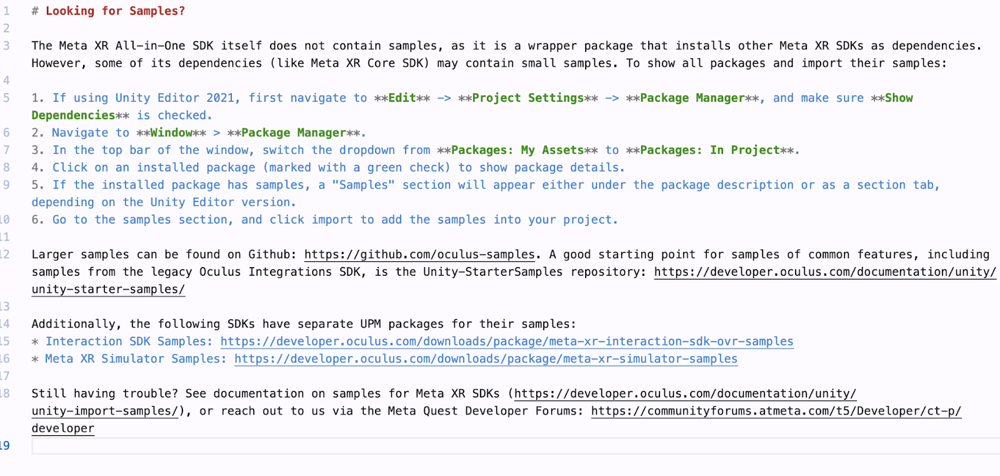

---

 **Step 3: Install XR Plugin Management**

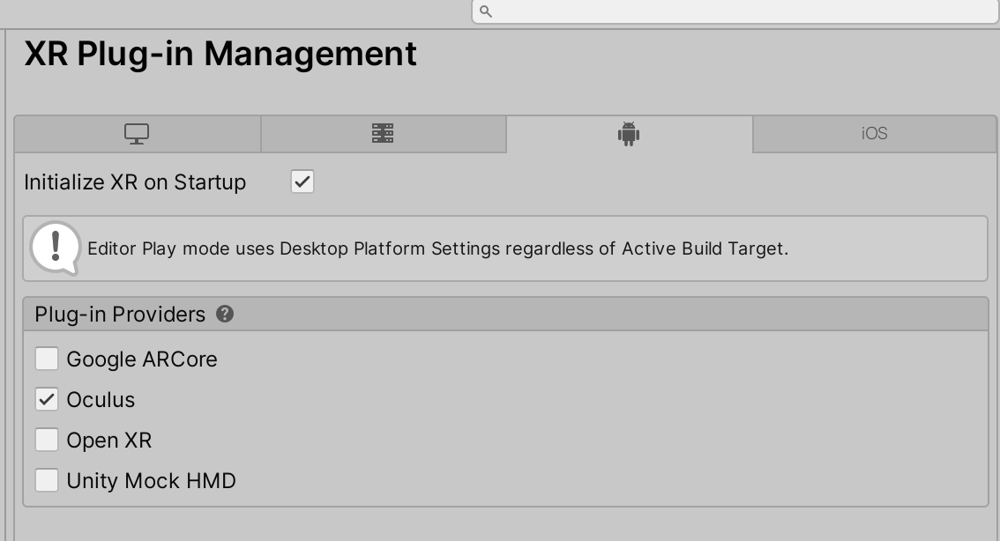

---

 **Step 4: Create a new scene**

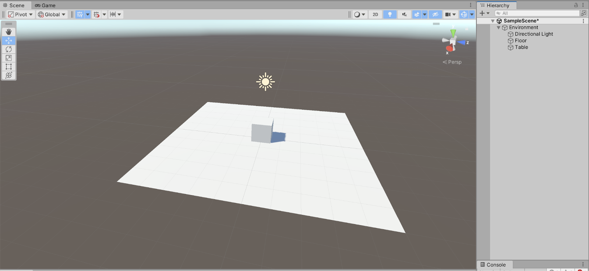

---

 **Step 5: Settings for controllers**

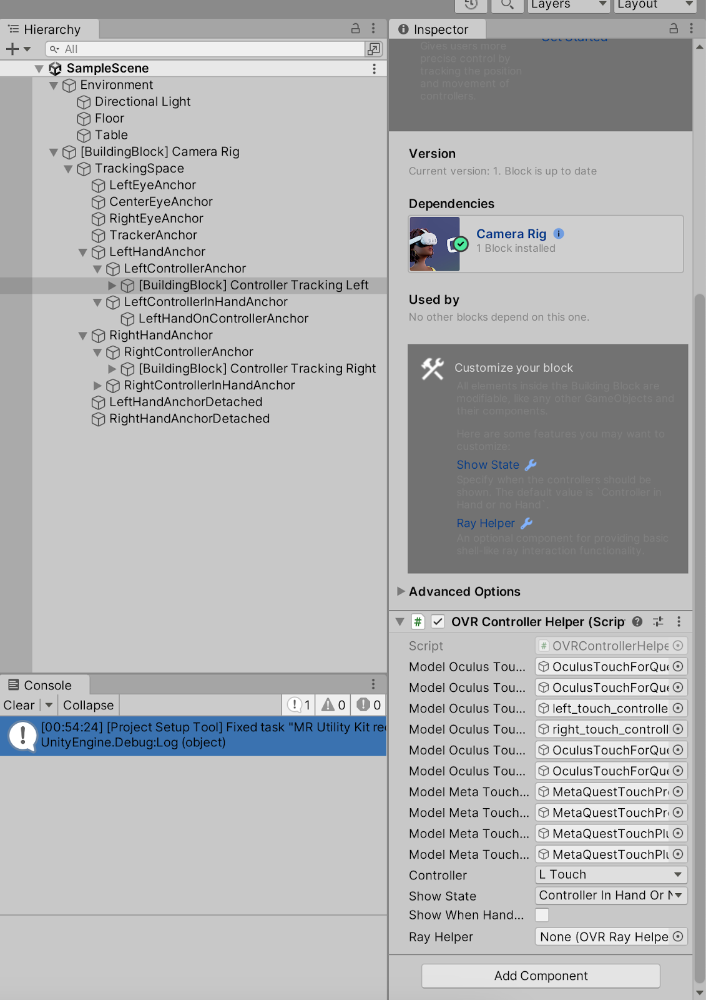

---

**Step 6: Setup the scene**

One major problem I encountered was that, since I’m working on a MacBook, I couldn’t run or test the VR project directly on a Meta headset. To overcome this, I had to rely on the Meta XR Simulator for development and testing. This required configuring the project in Unity 2022, ensuring compatibility with the OpenXR plugin, and properly setting up the simulator as the active runtime. Only after completing these steps was I finally able to simulate controller and headset input on my local machine.

---

**Step 7: Add collider for Roll-a-Ball**

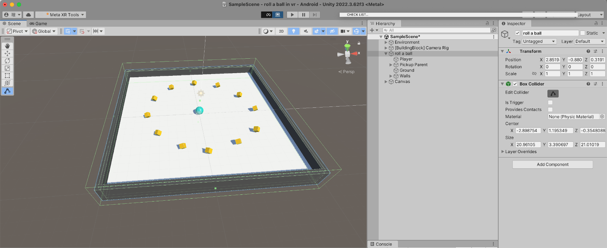

---

**Step 8: Add layers and assign them to objects**

At first, I did not understand layers clearly. Later, I realized layers are just labels for detection. The order does not matter.

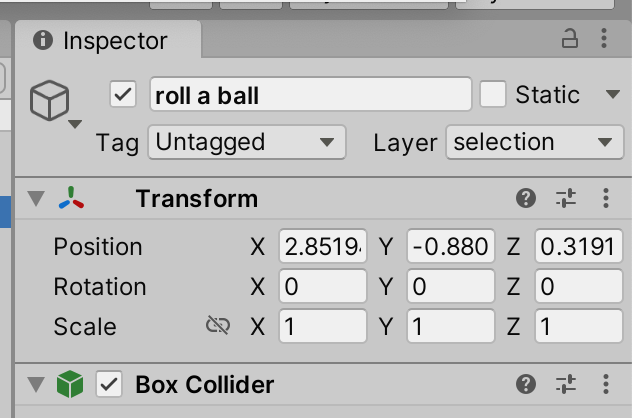

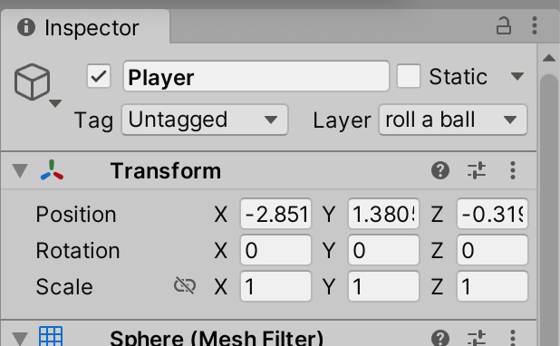

---

 **Step 9: Add collider to hand anchors and set them to the selection layer**

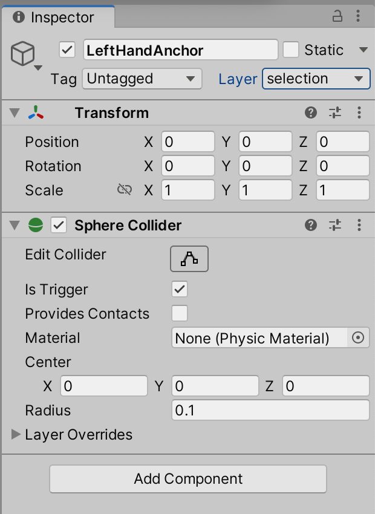

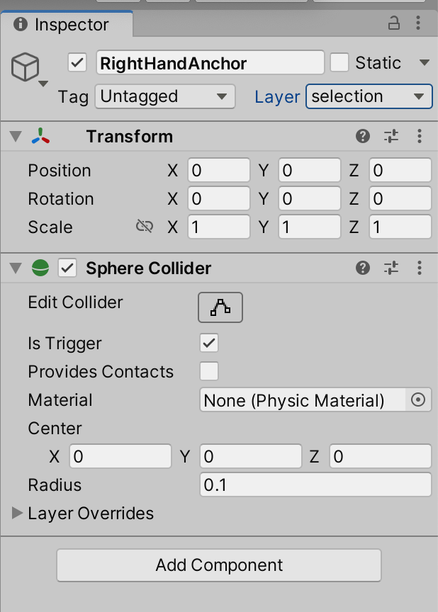

---

**Step 10: Disable collision between ?oll-a-Ball??and ?election??layers**

---

 **Step 11: Add Rigidbody and set different values**

Because we use trigger events, objects need Rigidbody. Hand anchors are set to Kinematic (no gravity). The ball uses gravity (not kinematic).

---

 **Step 12: write the interaction script and assign it to the hand anchor**
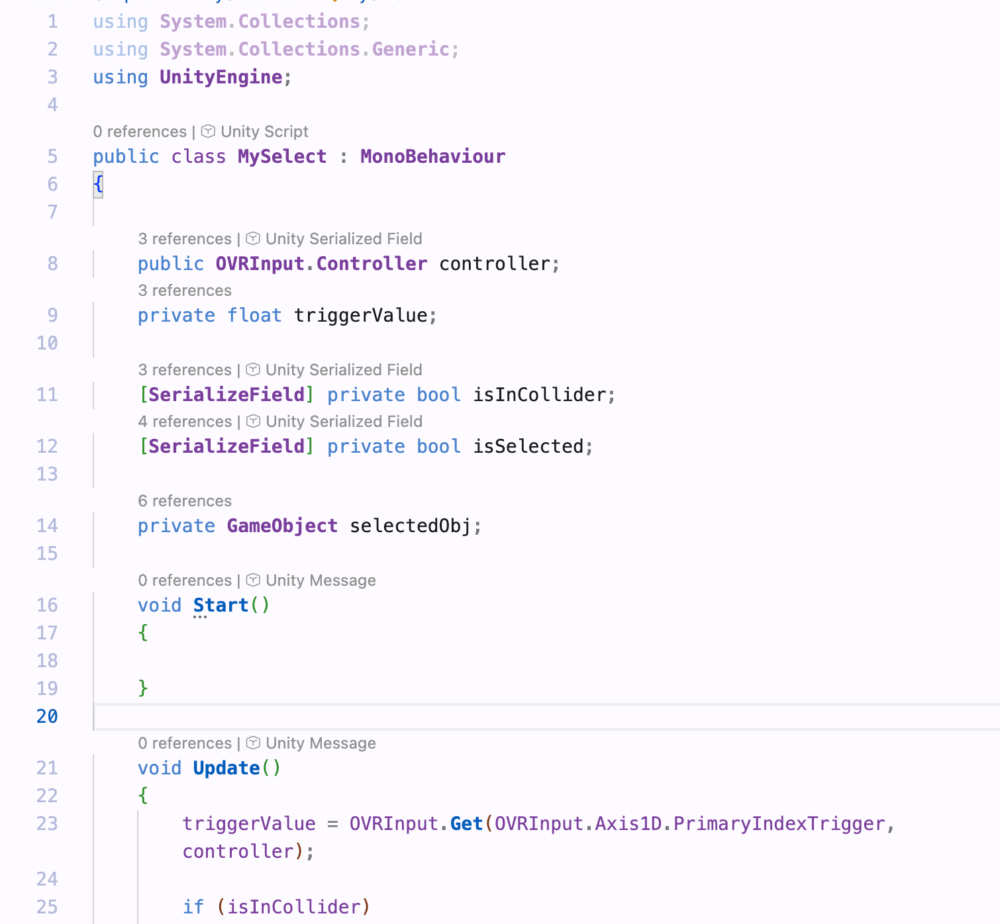

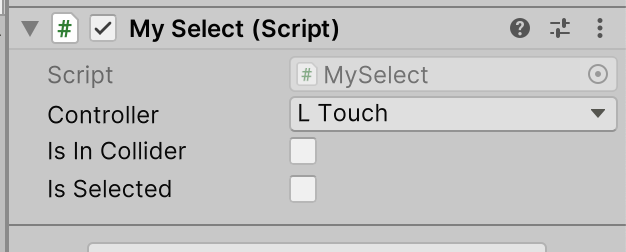

In this step we wrote a script allowing the controller to pick up and release a ball in VR. When the controller enters the ball? collider and the player pulls the trigger, the ball becomes a child of the controller and follows its movement. When the trigger is released, the ball is detached, gravity is enabled again, and the ball continues moving based on the velocity of the hand.

Direct Selection

---

**Problems / Notes**

  **1) PickUp objects no longer detected**

I implemented direct selection and grabbing, but the original PickUp detection stopped working. I checked colliders, trigger settings, tags, and layers, but it still did not work. Even when I created a new cube with `Is Trigger` and tag `PickUp`, nothing appeared in the console.

  **2) Raycasting issue (material / color)**

I tried to change the object color when hit by the ray, but I lost the material. In the end, I only displayed the ray and used it to move the object.

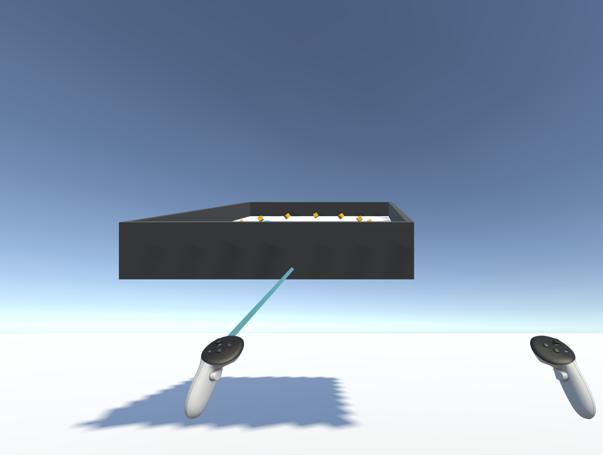

---

  **Result**

The VR version can run in VR, and direct selection works (grab/release). Raycasting partially works (ray + moving object).

