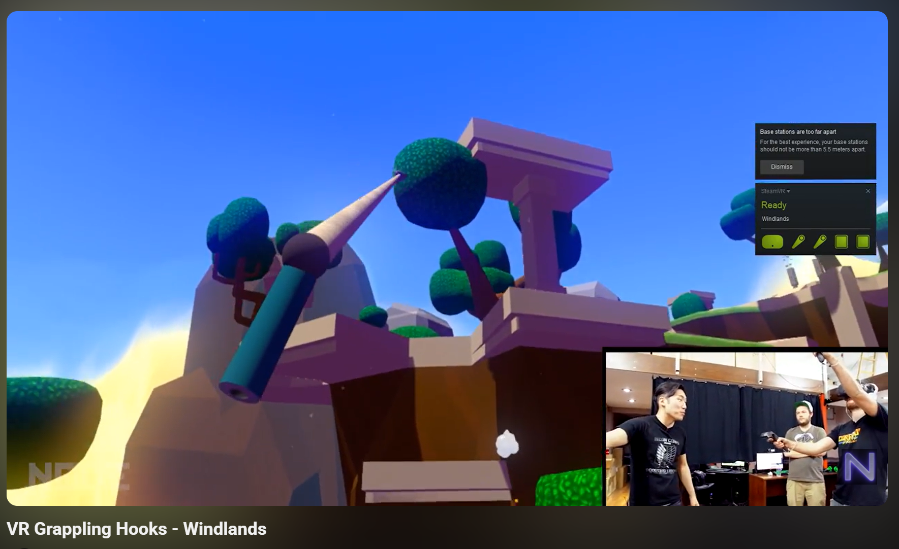
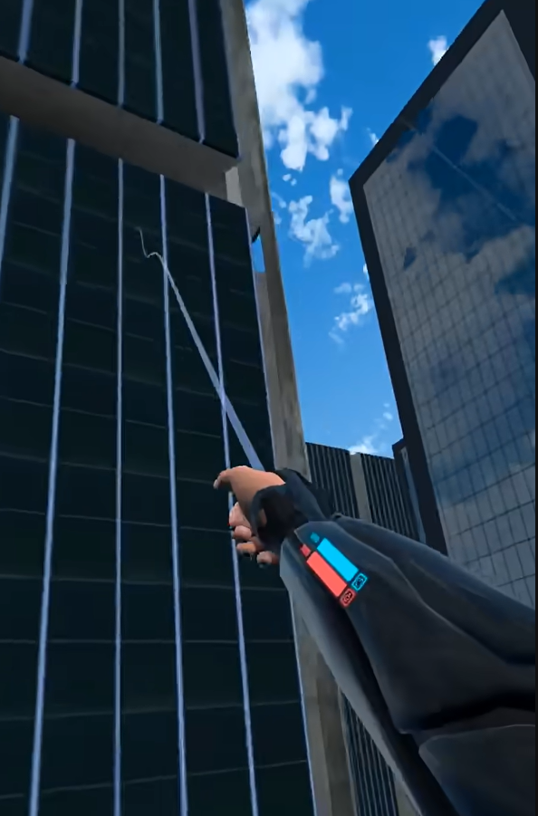

---

title: "Lecture 1: VR Locomotion Ideas"

date: 2026-01-29

weight: 6

draft: false

---

In this assignment, I explored three different VR movement technologies, understanding their goals, principles, and evaluation methods.

### Concept 1: Arm Swing "Power Glide"

* **Goal:** Enhance immersion and fun, balancing exercise intensity and comfort.
* **How it works:**

  * **Interaction metaphor:** Mimics real-world walking by generating movement through arm swinging.
  * **System Logic:** Implemented in Unity. It detects the speed of the left and right controllers (swing power) and uses the trigger buttons and a threshold to determine movement. Speed is controlled using a curve to fit the parkour environment.
* **Evaluation:**

  * Compare with traditional joystick movement.
  * Metrics: Record time to complete the route, accuracy of collecting coins, and fun rating (1-10).

### Concept 2: Nod-to-Zoom Teleportation

* **Goal:** Provide a stable, low-motion sickness risk movement option for users with limited mobility.
* **How it works:**

  * **Interaction metaphor:** Uses gaze and physical nods as confirmation.
  * **System Logic:** Tracks the user’s eye movement via the head-mounted display (HMD) to detect slight "nodding" (up/down movement) which triggers instant teleportation.
* **Evaluation:**

  * Metrics: Use the Simulator Sickness Questionnaire (SSQ) to evaluate the effect on motion sickness (1-10).

### Concept 3: Elastic Slingshot / Grappling Hook

* **Goal:** Achieve high vertical maneuverability and entertainment immersion. The goal is to allow users to quickly and precisely reach floating platforms in a parkour-like environment.
* **How it works:**

  1. **Point and Lock:** Users aim the controller at a target (such as a platform) and press the trigger to launch an energy beam (raycast) to hook the target.
  2. **Physical Stretch:** A visible elastic line forms between the controller and the target.
  3. **Power Trigger:** Users pull the controller towards themselves, and the system calculates a forward force based on the controller’s displacement and speed, launching the player towards the target.
* **Evaluation:**

  * **Comparison:** Compare with traditional "teleportation" technology.
  * **Metrics:**

    1. Direction accuracy.
    2. Immersion rating: A survey to assess the sense of being immersed in the environment (1-10).

