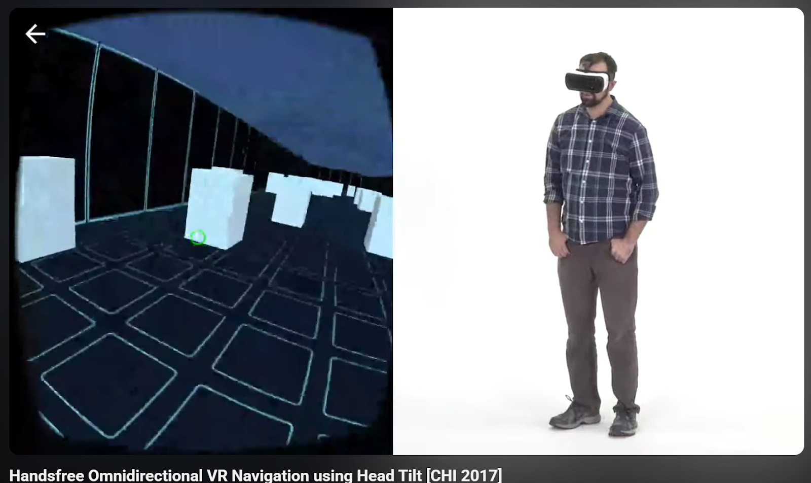

---

title: "Lecture 1: VR Locomotion Ideas"

date: 2026-01-29

weight: 5

draft: false

---

\*\*Idea1: Footstep-based Locomotion\*\*

\*\*Goal\*\*

The goal of this approach is to keep the feeling of walking while reducing the amount of physical space needed in the real world, so that continuous walking in VR can be supported in a small physical space.

\*\*How it works\*\*

The system uses an MPU6050 sensor to detect the user’s footstep movements or walking actions, such as foot lifting, rhythm, and step frequency, instead of the user’s actual physical displacement. The user changes their facing direction in the real world to control the walking direction in VR. Then, by stepping in place or making small walking movements, the user’s rhythm or step frequency determines the walking speed in the virtual environment.

In this way, the bodily feeling of “walking” is preserved, while the user does not need to physically walk a long distance.

\*\*Evaluation\*\*

Compare with joystick-based locomotion and real walking locomotion

Record the time required to complete the route

Evaluate presence, motion sickness, and user comfort

Use a subjective questionnaire to ask whether the walking feels natural, easy to understand, and physically tiring

---

\*\*Idea2: Doodle-based Path Locomotion\*\*

\*\*Goal\*\*

In many game tasks, users need to control their walking path with a high level of precision. This locomotion method aims to allow users to draw a walking path through doodling and restrict their movement within the drawn route, so that tasks requiring precise path control can be completed more easily.

\*\*How it works\*\*

In the VR scene, the user uses a controller or hand gestures to draw a doodle path on the ground or in the space. This path is recognized by the system as a walkable route, and the user’s movement is constrained to this path. During locomotion, the user can only move along the drawn path and cannot deviate from it, which helps reduce wrong turns or deviation from the target. 

By using a “plan first, then move” mechanism, this approach reduces the need for precise real-time path control.

\*\*Evaluation\*\*

Compare with free locomotion methods (such as joystick locomotion) by completing the same coin-collection task in the same map

Record the time required to complete the task

Evaluate the user’s confidence in path control and the ease of task completion

Subjective questionnaire: whether the method is easy to understand, helpful for task completion, and overly restrictive

---

\*\*Idea3: Hand-swing-based Locomotion\*\*

\*\*Goal\*\*

Similar to the first locomotion method, this approach enables movement in the VR world by reproducing the user’s hand swinging motion during walking.

This locomotion method aims to use natural arm swinging to enhance bodily involvement in walking, while reducing the dependence on real-world physical movement, allowing users to achieve continuous movement in a small physical space.

\*\*How it works\*\*

The system detects the swinging motion of both hands through the movement of the controllers, such as swing amplitude, frequency, and rhythm. When the user performs arm swinging motions similar to walking in the real world, the system maps these swinging signals to forward movement in the VR environment. The frequency and amplitude of the hand swings can affect the movement speed in VR, while the walking direction is determined by the user’s facing direction or head orientation.

In this way, the user does not need to physically walk and can experience walking in the virtual world simply by swinging their hands.

\*\*Evaluation\*\*

Compare with joystick locomotion and footstep-based locomotion

Record the time required to complete the task or route

Evaluate presence, motion sickness, and upper-body fatigue

Subjective questionnaire: whether the motion feels natural, easy to learn, and physically tiring

